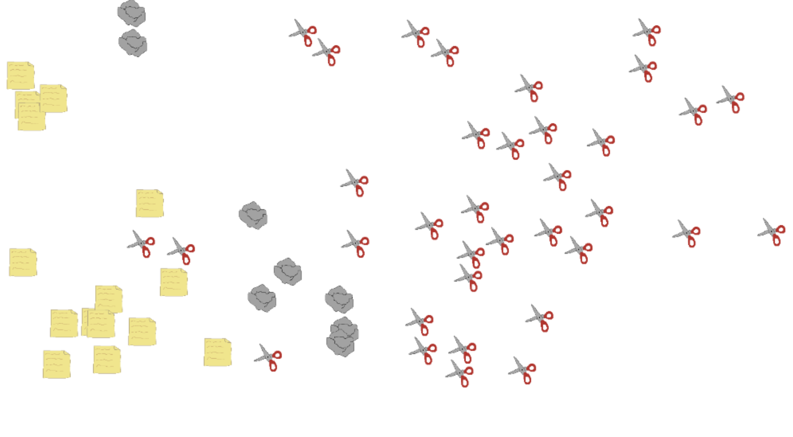

# Rock Paper Scissors Simulator


## 프로젝트 소개
Rock Paper Scissors Simulator는 가위바위보 게임을 시각적 시뮬레이션으로 재해석한 프로젝트입니다. 가위, 바위, 보 이미지가 화면에서 자유롭게 움직이며 충돌할 때마다 승패 규칙에 따라 승자의 형태로 변환됩니다.

## 기능
- 시각적 변환: 충돌 시 승리 요소로 즉각적인 이미지 변환 효과
- 랜덤 생성: 페이지가 로딩 될 때마다 새로운 위치에 요소들 생성

## 기술 스택
- 프론트엔드: Typescript, HTML5 Canvas, CSS3

## 전제 조건
- Node.js 18.x or higher

## 설치
```zsh
git clone https://github.com/enKODING1/rock-paper-scissors-simulator.git
cd rock-paper-scissors-simulator
npm install
npm run dev
```

## 향후 계획
- 통계 분석: 실시간으로 요소의 개체 수와 변화 추이를 그래프로 시각화
- 커스터마이징: 초기 요소 수, 속도, 크기 등 다양한 파라미터 조절 가능
